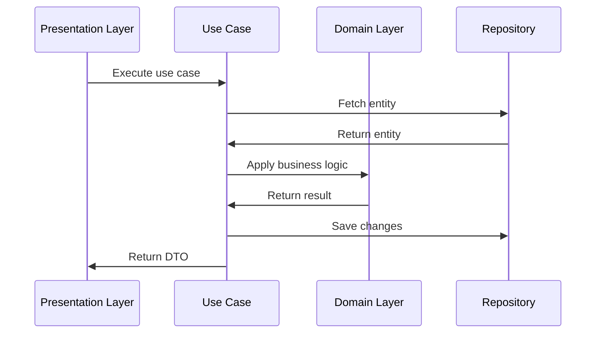
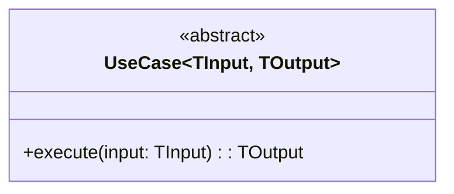

# Application Layer

The application layer orchestrates domain objects to fulfill application requirements.

## Structure

```
{{cookiecutter.project_slug}}/application/
├── __init__.py
├── use_cases.py  # Application use cases
└── dtos.py       # Data Transfer Objects
```

## Key Files

- [`use_cases.py`](../{{cookiecutter.project_slug}}/application/use_cases.py): Application use cases
- [`dtos.py`](../{{cookiecutter.project_slug}}/application/dtos.py): Data transfer objects

## Use Case Flow



## Use Case Pattern



## Design Principles

- **Single Responsibility**: One use case per business operation
- **Dependency Inversion**: Use cases depend on abstractions
- **Input/Output DTOs**: Clear data contracts
- **Transaction Boundaries**: Use cases define transaction scope

## Adding New Use Cases

1. Define input and output DTOs
2. Create use case class implementing `UseCase` interface
3. Inject required repositories/services
4. Implement business logic orchestration
5. Update sequence diagrams above