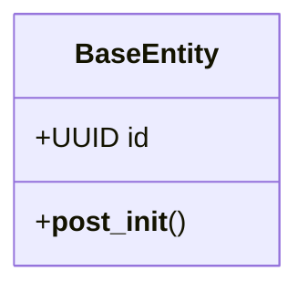

# Domain Layer

The domain layer contains the core business logic and rules for {{cookiecutter.project_name}}.

## Structure

```
{{cookiecutter.project_slug}}/domain/
├── __init__.py
├── entities.py      # Business entities
└── value_objects.py # Value objects
```

## Key Files

- [`entities.py`](../{{cookiecutter.project_slug}}/domain/entities.py): Core business entities
- [`value_objects.py`](../{{cookiecutter.project_slug}}/domain/value_objects.py): Immutable value objects

## Entity Relationships



## Design Principles

- **Single Responsibility**: Each entity has one reason to change
- **Rich Domain Model**: Entities contain business logic
- **Immutable Value Objects**: Value objects cannot be modified after creation
- **Domain Invariants**: Business rules are enforced in the domain layer

## Adding New Entities

1. Create entity class inheriting from `BaseEntity`
2. Add business logic methods to the entity
3. Update the class diagram above
4. Add unit tests for business logic