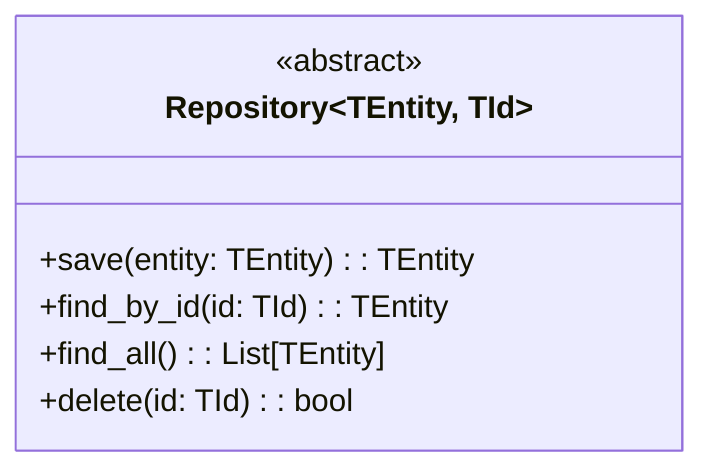
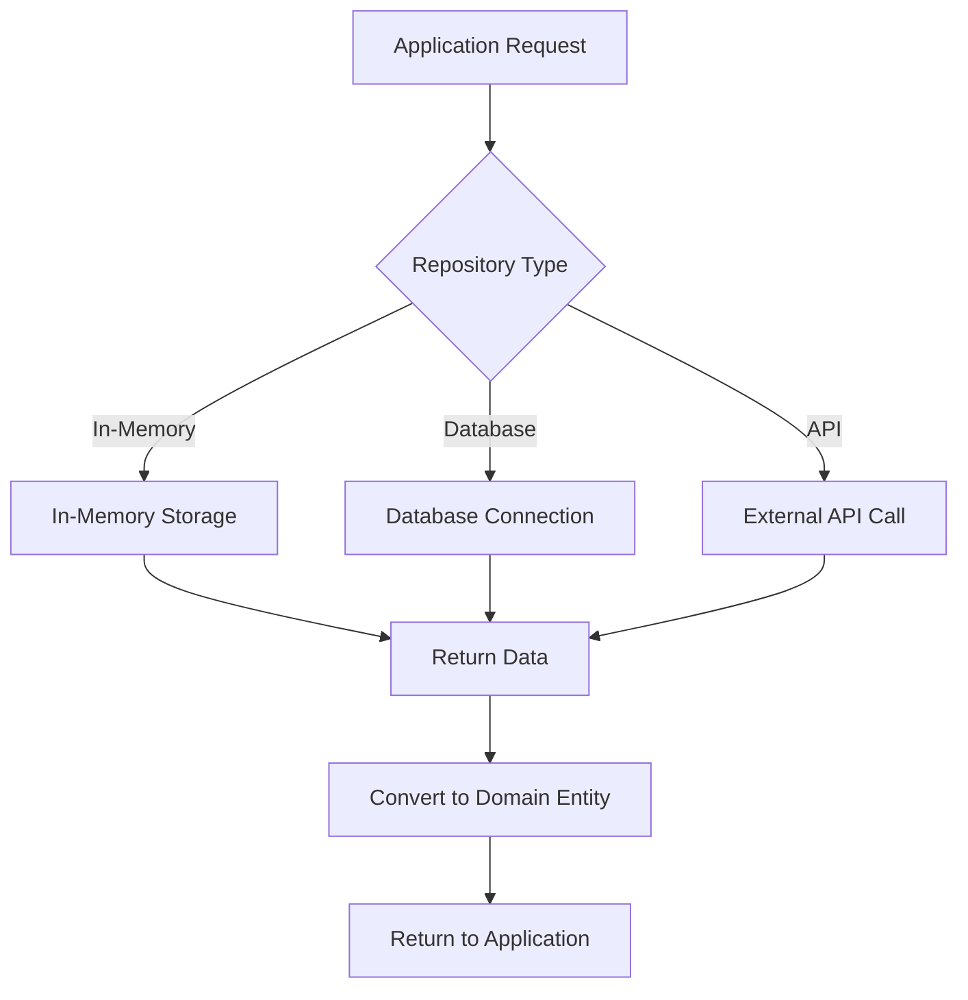

# Infrastructure Layer

The infrastructure layer implements external concerns like databases, APIs, and file systems.

## Structure

```
{{cookiecutter.project_slug}}/infrastructure/
├── __init__.py
└── repositories.py  # Repository implementations
```

## Key Files

- [`repositories.py`](../{{cookiecutter.project_slug}}/infrastructure/repositories.py): Data access implementations

## Repository Pattern



## Infrastructure Workflows



## Database Schema

```mermaid
erDiagram
    %% Add your database tables here
    %% USERS {
    %%     uuid id PK
    %%     string name
    %%     string email
    %%     datetime created_at
    %% }
```

## Design Principles

- **Dependency Inversion**: Infrastructure implements domain interfaces
- **Repository Pattern**: Abstract data access
- **Factory Pattern**: Create appropriate implementations
- **Configuration-Driven**: Environment-specific configurations

## Adding New Infrastructure

1. Define repository interface in domain layer
2. Implement concrete repository in infrastructure layer
3. Add configuration for different environments
4. Update ER diagram if database changes
5. Add integration tests