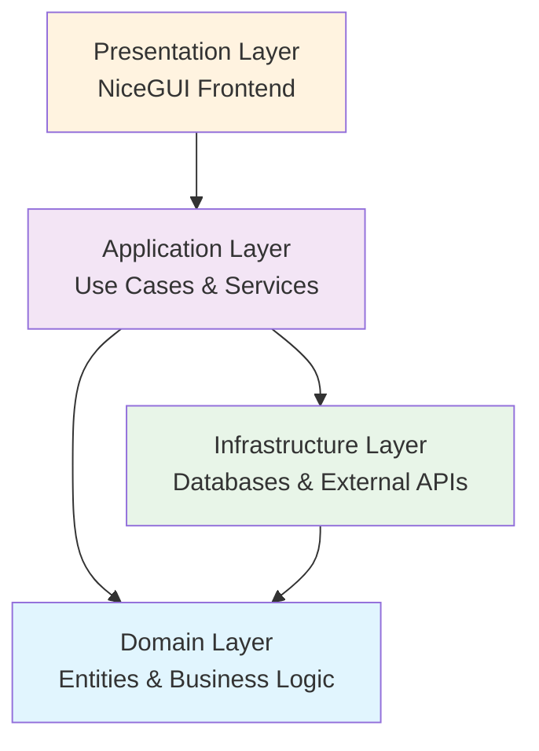

# Architecture Overview

{{cookiecutter.project_name}} follows Clean Architecture principles with Domain-Driven Design (DDD).

## Core Concept
{{cookiecutter.main_idea}}

## Key Features
{{cookiecutter.key_features}}

## Target Users
{{cookiecutter.target_users}}

## Architecture Layers

## Layer Responsibilities

### Domain Layer
- Business entities and value objects
- Domain services and business rules
- Core business logic

### Application Layer  
- Use cases and application services
- Data Transfer Objects (DTOs)
- Orchestrates domain objects

### Infrastructure Layer
- Database implementations
- External API integrations
- File system operations
- Repository implementations

### Presentation Layer
- NiceGUI user interface
- Controllers and view models
- User interaction handling

## Design Patterns Used

- **Repository Pattern**: Data access abstraction
- **Use Case Pattern**: Application service organization
- **DTO Pattern**: Data transfer between layers
- **Factory Pattern**: Object creation
- **Strategy Pattern**: Algorithm selection
- **Observer Pattern**: Event handling