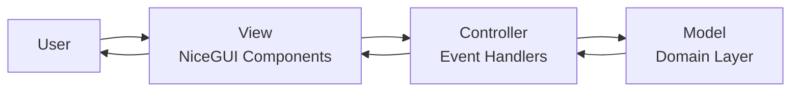
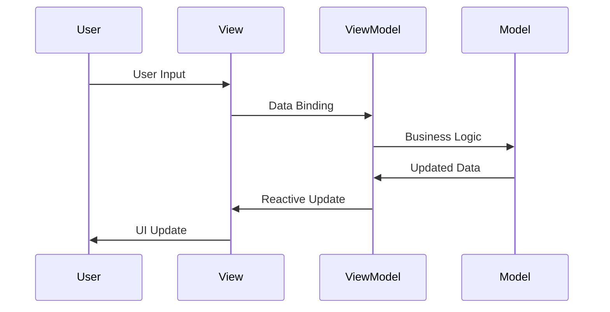
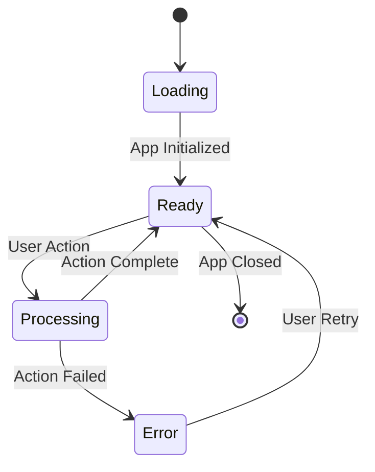
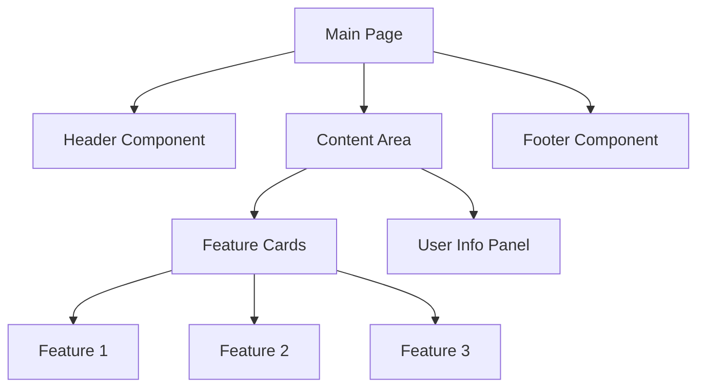

# Presentation Layer

The presentation layer handles user interface and interactions using NiceGUI.

## Structure

```
{{cookiecutter.project_slug}}/presentation/
├── __init__.py
└── gui.py  # NiceGUI frontend
```

## Key Files

- [`gui.py`](../{{cookiecutter.project_slug}}/presentation/gui.py): Main NiceGUI application

## UI Architecture Pattern

The frontend uses **MVC** pattern for simple applications:



For interactive applications, consider **MVVM** pattern:



## Application State



## Component Structure



## Design Principles

- **Component-Based**: Reusable UI components
- **Reactive**: UI updates based on state changes
- **Responsive**: Works on different screen sizes
- **Accessible**: Follows accessibility guidelines

## Adding New UI Components

1. Create component function in appropriate module
2. Add to main page layout
3. Connect to use cases via event handlers
4. Update component diagram above
5. Add Playwright tests for user interactions